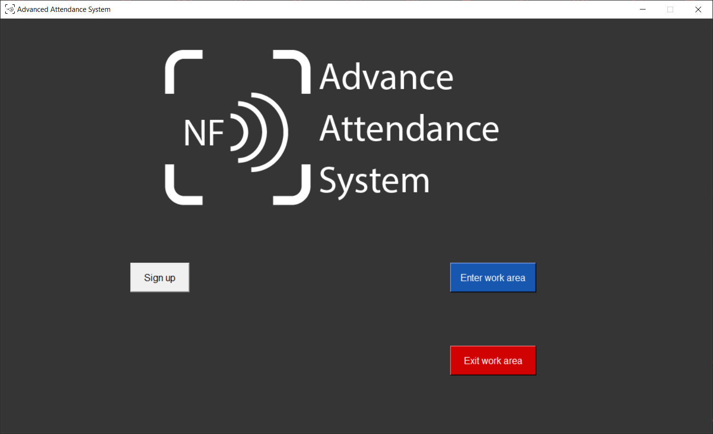
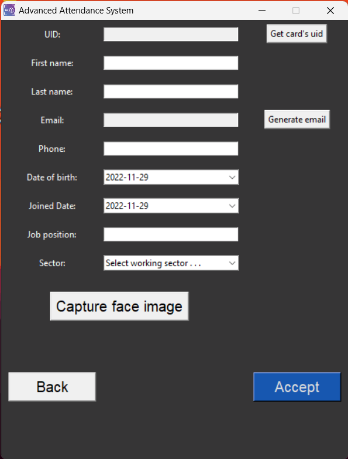
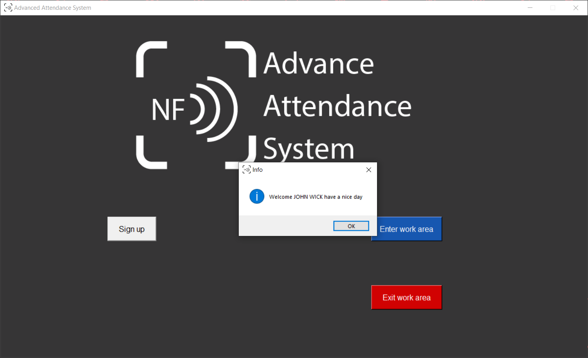
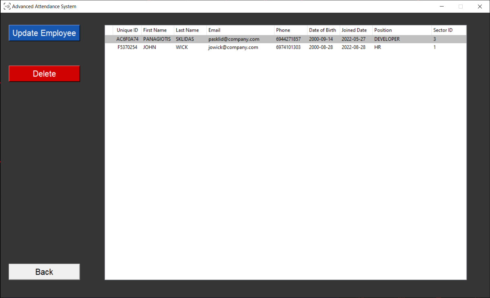

# Advanced Attendance System

<div>
    <div align="center">
        
    </div>
<br>
    
[](https://www.codefactor.io/repository/github/panagiotis-sklidas/advanced-attendance-system)

</div>

<!-- Contents -->

# Contents

- [About the Project](#about-the-project)
  - [Features](#features)
- [Getting Started](#getting-started)
  - [Prerequisites](#prerequisites)
  - [Run locally](#run-locally)
  - [Installation](#installation)
    - [Screenshots](#screenshots)
- [License](#license)
- [Acknowledgements](#acknowledgements)

<!-- About the Project -->

## About the Project

The current project concerns the thesis, which I had to implement as part of my studies in the Computer Science
department at International Hellenic University. Its topic is "Study, design, and development of software for the
controlled access into the workplace of employees with the help of an RFID smartcard and recognition of their face" in this framework, I created this software application for Windows computers in python.

<!-- Features -->

### Features

- New user registration
- Entry time recording with details from the RFID smart card and recognition of the employee's face
- Record the time of exit using the details from the smart RFID card of the employee
- CRUD and statistics view functions available to specific users

<!-- Getting Started -->

## Getting Started

<!-- Prerequisites -->

### Prerequisites

In order to use this application you should have the following hardware:

- Webcam
- RFID/NFC reader (I used ACR122U USB NFC Reader form Advanced Card Systeems Ltd.)
- Compatible RFID/NFC smartcards

<!-- Run Locally-->

### Run Locally

In order to run the application locally you should have the following installed:

- Python 3.9.6 (Download [here](https://www.python.org/downloads/release/python-396/))
- opencv-python 4.6.0.66

```
pip install opencv-python
```

- face_recognition (Find more [here](https://github.com/ageitgey/face_recognition)/troubleshooting video [here](https://www.youtube.com/watch?v=D5xqcGk6LEc#t=2m15s))
- pyscard 2.0.5

```
pip install pyscard
```

- Pillow 9.3.0

```
pip install Pillow
```

<br>

Note:
Or you can use the following commands to auto-install all dependencies

```
# Enter project folder
cd project/

# Install all dependencies
pip install -r requirements.txt
```

After installing all of the above you can build and run the application in your <strong>Windows</strong> machine using the following command:

```
<filepath> python app.py
```

<!-- Installation -->

### Installation

To be able to install the application you should have a Windows 10 x64bit machine.

- In order to install the application you should run the Advanced Attendance System.exe with <strong>administration</strong> rights
- In order to delete/remove the app run as <strong>administrator</strong> the Uninstaller.bat
  <br><br>
  Download the files from [here](https://github.com/Panagiotis-Sklidas/Advanced-Attendance-System/releases/tag/v1.0.3)

<!-- Usage -->

## Usage

Please read the user manual, that you will find [here](https://github.com/Panagiotis-Sklidas/Advanced-Attendance-System/blob/main/User%20Manual%20AAS.en.pdf).

### Screenshots






<!-- License -->

## License

Copyright@ 2022 Department of Computer Science, International University of Greece,
<br>[https://www.cs.ihu.gr](https://www.cs.ihu.gr)<br>
The content of this Thesis is the intellectual property of the author(s), the supervising professor and the Department of Informatics of IHU and is protected by the law on intellectual property (Law 2121/1993 and applicable International Law rules in GREECE).

<!-- Acknowledgments-->

## Acknowledgements

SUBJECT AREA: Software study, design and development
<br>
KEYWORDS: RFID/NFC, Face recognition, Python - Tkinter application, Windows desktop application.

- [IHU Website](https://www.cs.ihu.gr/index.xhtml;jsessionid=Jy-71XCR7OeMGBi-uXAygMK5mHmdBjHdvOYKjV-1.javaee2?language=en)
